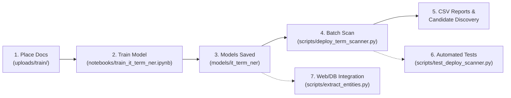

# IT Term Extraction & Classification from OJT Documents

An end-to-end Natural Language Processing (NLP) system built on **spaCy** to accurately extract, classify, and audit Information Technology (IT) terms, software libraries, programming languages, and hardware tools from student On-the-Job Training (OJT) documents (internship portfolios, daily activity logs, evaluation forms, and resumes).

Unlike generic Named Entity Recognition (NER) models or basic keyword search, this system is specifically designed to distinguish genuine IT technical terms from general nouns, soft skills, or narrative prose (e.g., separating *"integrated Stripe API"* from *"integrated my skills into the project"*).

---

## Key Highlights

- **Dual-Engine Architecture**: Combines deterministic phrase matching from a curated dictionary with unsupervised syntactic context mining and a trained statistical spaCy NER model.
- **Novel Term Discovery**: Uses dependency parse patterns (`TRIGGER_VERB -> OBJECT`) to automatically surface new and emerging technologies (e.g., Terraform, Prometheus, Tailwind) without requiring prior manual cataloging.
- **Low-Memory Streaming OCR**: Processes scanned PDF submissions page-by-page using Tesseract OCR and caches intermediate cleaned text on disk, preventing Out-Of-Memory (OOM) failures on large portfolios.
- **Continuous Learning Loop**: Newly discovered terms are saved to a review queue (`candidate_new_terms.csv`) ready for promotion into the seed dictionary to fuel periodic model retraining.
- **Web & Database Ready**: Includes CLI deployment tools as well as a direct MySQL backend script (`extract_entities.py`) designed to return structured JSON payloads to PHP/web frontends with IT vs. Clerical percentage metrics.

---

## Repository Structure & Directory Requirements

Not all project directories are tracked in Git due to file sizes, dynamic outputs, and privacy concerns. Refer to the directory listing below to understand what is tracked vs. what must be created at runtime.

```
spacy/
├── .gitignore                      # Git ignore rules (models, uploads, caches)
├── README.md                       # Master project overview & guide (this file)
├── requirement.txt                 # Frozen Python dependencies
│
├── data/                           # Curated dictionaries and silver-standard datasets
│   ├── it_terms.csv                # Predefined dictionary (term, label)
│   └── annotations_for_review.jsonl# [Generated] Synthesized silver annotations for audit
│
├── documentation/                  # Comprehensive technical documentation suite
│   ├── README.md                   # Documentation hub & architecture diagram
│   ├── notebooks/
│   │   └── train_it_term_ner.md    # In-depth guide for the training notebook
│   └── scripts/
│       ├── context_miner.md        # Deep-dive into syntactic dependency parsing
│       ├── deploy_term_scanner.md  # CLI deployment scanner & batch processing manual
│       ├── extract_entities.md     # MySQL backend service & PHP JSON integration
│       └── test_deploy_scanner.md  # Automated integration test harness guide
│
├── notebooks/                      # Interactive ML & training pipelines
│   └── train_it_term_ner.ipynb     # 9-step notebook: OCR, silver synthesis, NER training
│
├── scripts/                        # Production tools and core modules
│   ├── __init__.py
│   ├── context_miner.py            # Syntactic dependency pattern miner
│   ├── deploy_term_scanner.py      # Batch CLI scanner (ruler / ner / hybrid modes)
│   ├── extract_entities.py         # MySQL + PHP backend extraction service
│   └── test_deploy_scanner.py      # Automated testing script
│
└── [REQUIRED RUNTIME DIRECTORIES — NOT RECORDED IN GIT]
    ├── .venv/                      # Python virtual environment
    ├── models/                     # Serialized spaCy model pipelines
    │   ├── it_terms.csv            # Reference copy of terms dictionary
    │   ├── it_term_ruler/          # Rule-based EntityRuler pipeline
    │   └── it_term_ner/            # Trained statistical NER pipeline
    ├── uploads/                    # Document ingestion roots
    │   ├── train/                  # Raw training documents (.pdf, .docx, .txt)
    │   └── test/                   # Evaluation & testing documents (.pdf, .docx, .txt)
    ├── _text_cache/                # Disk cache for cleaned OCR & extracted text
    ├── _test_results/              # Default destination for automated test outputs
    └── results/                    # Default destination for deploy scanner outputs
```

### Initializing Missing Directories
After cloning this repository, initialize all runtime directories with a single command:
```bash
mkdir -p models uploads/train uploads/test _text_cache _test_results results
```

---

## Prerequisites & Installation

### 1. System-Level Dependencies
For reading scanned PDF documents, Tesseract OCR and Poppler utilities must be installed on your host system:

- **Ubuntu / Debian**:
  ```bash
  sudo apt update
  sudo apt install -y tesseract-ocr poppler-utils
  ```
- **macOS** (Homebrew):
  ```bash
  brew install tesseract poppler
  ```
- **Windows**:
  - Install [Tesseract-OCR](https://github.com/UB-Mannheim/tesseract/wiki) and add its folder to your system `PATH`.
  - Download [Poppler for Windows](https://github.com/oschwartz10612/poppler-windows/releases/) and add its `bin/` directory to `PATH`.

### 2. Python Environment Setup
We recommend Python 3.10 or higher within an isolated virtual environment:

```bash
# 1. Create and activate virtual environment
python3 -m venv .venv
source .venv/bin/activate  # On Windows: .venv\Scripts\activate

# 2. Install dependencies
pip install -r requirement.txt

# 3. Download the spaCy English model (required for POS & dependency parsing)
python -m spacy download en_core_web_sm
```

---

## Complete Workflow & Usage



### Step 1: Prepare Training Documents
Place your unannotated student OJT submissions (`.pdf`, `.docx`, `.txt`) into:
```
uploads/train/
```
The system will automatically detect file extensions and select the appropriate extraction strategy.

### Step 2: Train the NER Model
Launch Jupyter Notebook and open [train_it_term_ner.ipynb](notebooks/train_it_term_ner.ipynb):
```bash
jupyter notebook notebooks/train_it_term_ner.ipynb
```
Run the notebook top-to-bottom. The pipeline will:
1. Load [data/it_terms.csv](data/it_terms.csv) and build a rule-based `EntityRuler`.
2. Extract, normalize, de-hyphenate, and cache text page-by-page to `_text_cache/`.
3. Mine candidate tech terms using [context_miner.py](scripts/context_miner.py).
4. Synthesize a silver-standard training set combining dictionary matches and `TECH_TERM` candidates.
5. Train a statistical `ner` pipeline using compounding minibatches and dropout.
6. Export serialized models to:
   - `models/it_term_ruler/` (rule-based pipeline)
   - `models/it_term_ner/` (statistical NER model)

### Step 3: Run Batch Document Scanning
Use [deploy_term_scanner.py](scripts/deploy_term_scanner.py) to process new student submissions:

```bash
python scripts/deploy_term_scanner.py \
    --input uploads/test \
    --terms-csv data/it_terms.csv \
    --model models/it_term_ner \
    --mode hybrid \
    --output results/
```

#### Scanning Modes:
- `--mode hybrid` *(Default & Recommended)*: Official counts come from exact dictionary matches, while NER predictions and syntactic patterns surface candidate unlisted terms into `candidate_new_terms.csv`.
- `--mode ruler`: Fast, dictionary-only exact matching. Requires no trained model.
- `--mode ner`: Counts driven by the trained statistical model.

### Step 4: Run Automated Verification Tests
Run [test_deploy_scanner.py](scripts/test_deploy_scanner.py) to automatically verify the deployment scanner against test files:
```bash
python scripts/test_deploy_scanner.py
```
This executes preflight checks, runs a sample scan on the smallest files in `uploads/test/`, validates CSV generation, and prints summary metrics.

### Step 5: Web & MySQL Production Integration
For production web applications (e.g. PHP portals), [extract_entities.py](scripts/extract_entities.py) can be called directly with a document path:

```bash
python scripts/extract_entities.py "uploads/test/ODON_PORTFOLIO.pdf"
```
The script connects to MySQL (`nbsc_ojt`), matches against `predefined_entities`, resolves overlapping spans, classifies activities (Software vs. Hardware vs. Clerical), and emits a structured JSON payload to `stdout`.

---

## Data Specifications & Output Schemas

### 1. Predefined Terms Dictionary (`data/it_terms.csv`)
Two columns: `term` and `label`.
```csv
term,label
Python,PROG_LANG
React,FRAMEWORK
MySQL,DATABASE
Docker,TOOL
AWS,CLOUD
Linux,OS
REST API,CONCEPT
Agile,METHODOLOGY
```

### 2. Output CSV Reports (Generated by `deploy_term_scanner.py`)
- **`term_matches_detail.csv`**: Granular record of every document, term, label, and frequency count.
- **`term_matches_summary.csv`**: Pivot table showing match counts with documents on rows and terms across columns.
- **`category_summary.csv`**: Pivot table showing document-level aggregate counts per high-level category (`DATABASE`, `PROG_LANG`, etc.).
- **`candidate_new_terms.csv`**: Candidate terms discovered in context but **not yet in the dictionary**, ranked by document count and total frequency. Includes trigger verbs and context sentences for human triage.

---

## Detailed File Documentation

For full function signatures, regex patterns, database configurations, and implementation details, consult the dedicated documentation in the `documentation/` directory:

- [documentation/README.md](documentation/README.md) — Documentation index & system flow
- [context_miner.md](documentation/scripts/context_miner.md) — Syntactic context mining engine
- [deploy_term_scanner.md](documentation/scripts/deploy_term_scanner.md) — Deployment scanner CLI
- [extract_entities.md](documentation/scripts/extract_entities.md) — MySQL & PHP integration service
- [test_deploy_scanner.md](documentation/scripts/test_deploy_scanner.md) — Automated integration test harness
- [train_it_term_ner.md](documentation/notebooks/train_it_term_ner.md) — 9-step training pipeline walkthrough

---

## Continuous Improvement & Feedback Loop

1. **Scan Submissions**: Run `deploy_term_scanner.py` on incoming student portfolios.
2. **Triage Candidates**: Open `results/candidate_new_terms.csv`. Identify emerging tools (e.g., `FastAPI`, `Supabase`, `Next.js`).
3. **Update Dictionary**: Append newly approved terms with their proper label to [data/it_terms.csv](data/it_terms.csv).
4. **Retrain**: Re-run [train_it_term_ner.ipynb](notebooks/train_it_term_ner.ipynb). The newly added terms are now treated as specific category entities, allowing the model to adapt and generalize continuously.
