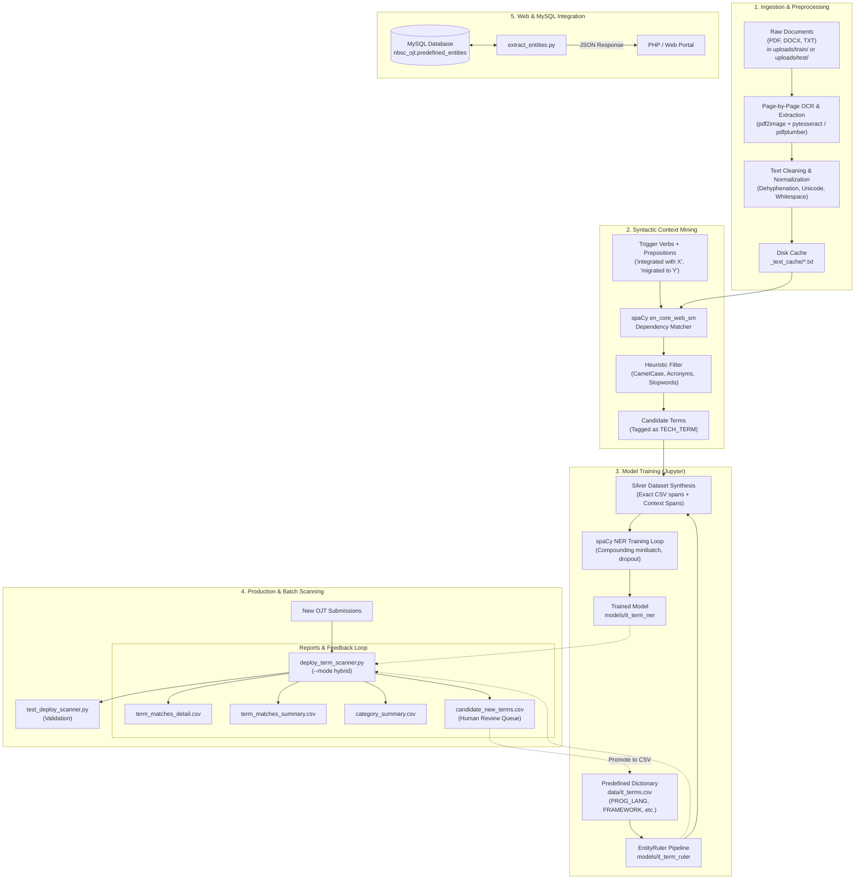

# Project Documentation Hub

Welcome to the internal technical documentation for the **IT Term Extraction from OJT Documents** project. This documentation suite provides file-by-file explanations, architecture diagrams, input/output schemas, and integration recipes.

---

## Documentation Navigation

| Document | Component Type | Primary Purpose | Key Dependencies |
| :--- | :--- | :--- | :--- |
| [context_miner.md](scripts/context_miner.md) | Python Module (`scripts/`) | Unsupervised dependency-parser mining for unlisted IT terms | `spacy`, `en_core_web_sm` |
| [deploy_term_scanner.md](scripts/deploy_term_scanner.md) | CLI Deployment Script (`scripts/`) | Batch document scanner (`.pdf`, `.docx`, `.txt`) supporting ruler, ner, and hybrid modes | `pandas`, `spacy`, `pytesseract`, `pdf2image` |
| [extract_entities.md](scripts/extract_entities.md) | Backend Integration (`scripts/`) | Production PDF entity extractor interfacing with MySQL (`nbsc_ojt`) for PHP frontends | `mysql-connector-python`, `pdfplumber`, `spacy` |
| [test_deploy_scanner.md](scripts/test_deploy_scanner.md) | Integration Test Harness (`scripts/`) | Automated verification script testing deployment scanner execution and report generation | `pandas`, `subprocess`, `pathlib` |
| [train_it_term_ner.md](notebooks/train_it_term_ner.md) | Jupyter Notebook (`notebooks/`) | 9-step training pipeline: OCR streaming cache, silver annotation, NER model training | `spacy`, `tqdm`, `pdf2image`, `pytesseract` |

---

## Architectural Workflow

The following diagram illustrates how raw OJT documents pass through the text processing, candidate discovery, model training, and deployment pipelines:



---

## Directory Requirements

Due to file size and security, several directories are intentionally excluded from Git version control via `.gitignore`. When initializing the project in a fresh environment, ensure the following directory structure is present:

```
spacy/
├── .gitignore                      # Git exclusion rules
├── README.md                       # Project root documentation
├── requirement.txt                 # Pinned Python package dependencies
├── data/
│   ├── it_terms.csv                # Curated seed dictionary (term, label)
│   └── annotations_for_review.jsonl# [Generated] Silver annotations for manual audit
├── documentation/                  # File-by-file documentation suite
│   ├── README.md                   # This documentation hub
│   ├── notebooks/
│   │   └── train_it_term_ner.md    # Documentation for training notebook
│   └── scripts/
│       ├── context_miner.md        # Documentation for context_miner.py
│       ├── deploy_term_scanner.md  # Documentation for deploy_term_scanner.py
│       ├── extract_entities.md     # Documentation for extract_entities.py
│       └── test_deploy_scanner.md  # Documentation for test_deploy_scanner.py
├── notebooks/
│   └── train_it_term_ner.ipynb     # Interactive model training workflow
├── scripts/
│   ├── __init__.py
│   ├── context_miner.py            # Syntactic dependency miner
│   ├── deploy_term_scanner.py      # Production document scanner CLI
│   ├── extract_entities.py         # MySQL & PHP integration runner
│   └── test_deploy_scanner.py      # Automated testing script
│
├── [UNTRACKED / RUNTIME DIRECTORIES]
│   ├── .venv/                      # Python virtual environment
│   ├── models/                     # Saved model artifacts
│   │   ├── it_terms.csv            # Copied reference dictionary
│   │   ├── it_term_ruler/          # Rule-based spaCy EntityRuler pipeline
│   │   └── it_term_ner/            # Statistical spaCy NER model pipeline
│   ├── uploads/                    # Document ingestion roots
│   │   ├── train/                  # Training set documents (.pdf, .docx, .txt)
│   │   └── test/                   # Test set documents (.pdf, .docx, .txt)
│   ├── _text_cache/                # Disk cache for cleaned OCR & extracted text
│   ├── _test_results/              # Output directory for test_deploy_scanner.py
│   └── results/                    # Default output directory for deploy_term_scanner.py
```

### Quick Setup for Missing Directories
To create all required runtime directories at once:
```bash
mkdir -p models uploads/train uploads/test _text_cache _test_results results
```
