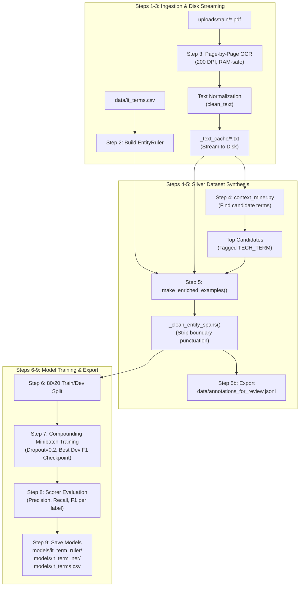

# Training Notebook (`notebooks/train_it_term_ner.ipynb`)

## 1. Overview

[train_it_term_ner.ipynb](../../notebooks/train_it_term_ner.ipynb) is the core interactive development and training environment. It implements an end-to-end 9-step machine learning pipeline that transforms raw, unannotated student OJT submissions (`.pdf`, `.docx`, `.txt`) into two specialized spaCy pipelines:
1. **Rule-Based Exact Matcher** ([models/it_term_ruler/](../../models/it_term_ruler)): High-precision deterministic dictionary matcher.
2. **Statistical NER Model** ([models/it_term_ner/](../../models/it_term_ner)): Deep transition-based named entity recognizer trained to identify both known categories and novel, unlisted technical tools (`TECH_TERM`).

---

## 2. Training Pipeline Architecture

---

## 3. Detailed Step-by-Step Breakdown

### Step 1: Load Predefined IT Terms
- Reads [data/it_terms.csv](../../data/it_terms.csv).
- Validates the presence of `term` and `label` columns.
- Strips whitespace and standardizes labels to uppercase (`PROG_LANG`, `FRAMEWORK`, `DATABASE`, `TOOL`, `CLOUD`, `OS`, `CONCEPT`, `METHODOLOGY`).

### Step 2: Build Rule-Based Matcher (`EntityRuler`)
- Initializes a blank English spaCy pipeline (`spacy.blank("en")`).
- Adds an `entity_ruler` component with `config={"phrase_matcher_attr": "LOWER"}` to ensure case-insensitive matching.
- Populates patterns from the CSV dictionary.

### Step 3: Streamed OCR, Text Cleaning & Disk Caching
Scanned PDF portfolios often trigger memory exhaustion if processed concurrently or held in RAM.
- **Page-by-Page OCR (`ocr_scanned_pdf`)**: Iterates through each page individually using `pdf2image.convert_from_path(first_page=i, last_page=i, dpi=200)` and extracts text with `pytesseract`. PIL images and intermediate strings are explicitly deleted per page.
- **Text Normalization (`clean_text`)**:
  - Applies NFKC Unicode normalization.
  - Converts smart quotes, curly dashes, and non-breaking spaces to ASCII (`_PUNCT_MAP`).
  - De-hyphenates words wrapped across line breaks: `inte-\ngrated` $\rightarrow$ `integrated`.
  - Converts escaped `\n` and `\t` into true whitespace.
  - Strips non-ASCII noise, OCR debris, and lines shorter than 2 characters.
- **Disk Caching**: Saves normalized text to `_text_cache/{doc_stem}_{hash}.txt`. Downstream cells stream files from disk rather than holding hundreds of megabytes in memory.

### Step 4: Syntactic Context-Pattern Mining
- Invokes [context_miner.py](../../scripts/context_miner.py) across all disk-cached texts using `en_core_web_sm`.
- Detects unlisted tools trailing trigger verbs (`"migrated to X"`, `"integrated with Y"`).
- Displays candidate frequencies and sample sentences to allow human verification of emergent student tools.

### Step 5: Silver-Standard Dataset Synthesis
Blends two distinct label streams into a unified training set:
1. **Specific Category Spans**: Exact matches from [it_terms.csv](../../data/it_terms.csv) tagged with their true category (e.g., `DATABASE`, `TOOL`).
2. **Generic Context Spans**: Context-mined candidates tagged with the generic label `TECH_TERM`.

#### Span Conflict Resolution & Sanitization
- Overlaps are resolved using `spacy.util.filter_spans()`, ensuring specific dictionary labels supersede generic context labels.
- `_clean_entity_spans()` trims trailing/leading punctuation (`.,;:!?()[]{}"'`) and whitespace from entity offsets, preventing spaCy token boundary alignment errors.

### Step 5b: Export for Manual Review
Exports synthesized annotations to [data/annotations_for_review.jsonl](../../data/annotations_for_review.jsonl). Practitioners can manually inspect or correct entity spans in standard annotation tools (e.g., Prodigy, Doccano, Label Studio) before retraining.

### Step 6: Train / Dev Split
- Splits examples into an 80% training set and a 20% validation set.
- A fixed seed (`random.seed(42)`) ensures reproducible splits.

### Step 7: Train Statistical NER Model
- Configures a blank English pipeline with a trainable `ner` component.
- Uses `spacy.util.compounding(4.0, 32.0, 1.001)` to dynamically scale batch sizes.
- Applies a dropout rate of `0.2` to prevent overfitting.
- Evaluates dev set F1 score after each epoch using `spacy.scorer.Scorer`.
- Serializes and retains in memory the best model bytes (`best_bytes`) based on peak dev F1 score.

### Step 8: Held-Out Evaluation
- Measures overall and per-label Precision, Recall, and F1.
- **Key Metric**: The `TECH_TERM` label score indicates how successfully the model generalizes to unlisted technologies based purely on contextual sentence structure.

### Step 9: Serialization & Deployment Artifacts
Exports final artifacts into [models/](../../models):
- `models/it_term_ruler/` — Saved exact-match pipeline.
- `models/it_term_ner/` — Saved statistical model pipeline.
- `models/it_terms.csv` — Reference dictionary copy.

---

## 4. Retraining & Continuous Learning Workflow

To improve model accuracy and expand coverage over time:
1. Run [deploy_term_scanner.py](../../scripts/deploy_term_scanner.py) on newly submitted documents.
2. Inspect `candidate_new_terms.csv` to review terms discovered in student portfolios.
3. Promote genuine technical terms into [data/it_terms.csv](../../data/it_terms.csv) with their correct category label (e.g., `Postman` $\rightarrow$ `TOOL`).
4. Re-run `train_it_term_ner.ipynb` from top to bottom. The promoted terms transition from generic `TECH_TERM` to specific categories, while newly observed patterns become the new `TECH_TERM` frontier.
