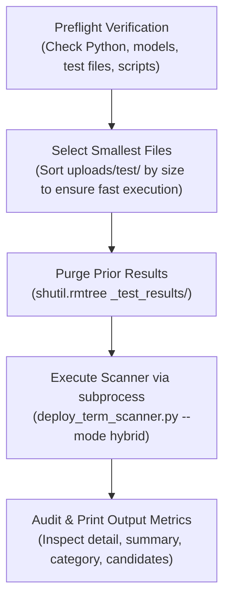

# Test Deploy Scanner (`scripts/test_deploy_scanner.py`)

## 1. Overview

[test_deploy_scanner.py](../../scripts/test_deploy_scanner.py) is an automated integration test harness designed to validate end-to-end functionality of [deploy_term_scanner.py](../../scripts/deploy_term_scanner.py).

It performs preflight environment checks, runs a benchmark scan against test documents in `uploads/test/`, and verifies the integrity of all generated CSV reports, printing an executive summary to the terminal.

---

## 2. Test Workflow



---

## 3. Configuration & Paths

The test script automatically resolves relative paths based on its own location in `scripts/`:

```python
WORKSPACE   = Path(__file__).resolve().parent.parent
TERMS_CSV   = WORKSPACE / "models" / "it_terms.csv"
NER_MODEL   = WORKSPACE / "models" / "it_term_ner"
SCANNER     = WORKSPACE / "scripts" / "deploy_term_scanner.py"
TEST_DIR    = WORKSPACE / "uploads" / "test"
RESULTS_DIR = WORKSPACE / "_test_results"
PYTHON      = WORKSPACE / ".venv" / "bin" / "python"
```

### Preflight Verification
Before executing, the script verifies that:
1. `uploads/test/` exists and contains readable test documents.
2. `models/it_terms.csv` is present.
3. `models/it_term_ner/` model directory exists.
4. `scripts/deploy_term_scanner.py` exists.
5. Virtual environment executable (`.venv/bin/python`) is valid.

If any check fails, the script terminates immediately with a descriptive error message.

---

## 4. Performance Optimization: Smallest-File Selection

Because scanned OJT portfolios can be hundreds of pages and require substantial OCR time, `pick_test_files()` sorts all files in `TEST_DIR` by file size and selects the smallest documents. This provides quick test turnaround while exercising all PDF OCR and parsing code paths.

---

## 5. Output Verification & Reporting

Upon completion, `print_results()` parses the generated artifacts in `_test_results/`:

| Artifact | Verification Performed | Sample Terminal Output |
| :--- | :--- | :--- |
| `term_matches_detail.csv` | Verifies existence, row count, document count, and prints Top 15 detected terms. | `154x Git`, `82x MySQL`, `45x PHP` |
| `term_matches_summary.csv` | Verifies pivot matrix dimensions (Docs $\times$ Terms). | `15 documents × 42 terms` |
| `category_summary.csv` | Computes column sums across broad classifications. | `120x DATABASE`, `85x TOOL`, `40x CLOUD` |
| `candidate_new_terms.csv` | Displays Top 10 candidate terms discovered by context mining or NER. | `[context_pattern] Kubernetes (count=5)` |

---

## 6. Execution

Run directly using Python:
```bash
python scripts/test_deploy_scanner.py
```

### Expected Output
```
Selected 15 test files (smallest from uploads/test/):
   0.8 MB  Navarro, Ma. Sweetzel Lyka.pdf
   1.2 MB  Pasilan, Jonard G.-OJT Forms.pdf
   ...
Running: deploy_term_scanner.py --input uploads/test --mode hybrid --output _test_results
======================================================================
Scanning 15 document(s) in mode='hybrid'...
  Navarro, Ma. Sweetzel Lyka.pdf: 14 matches across 6 distinct terms
  ...
======================================================================
Scanner exited with code 0 in 18.4s
======================================================================

📄 term_matches_detail.csv: 184 rows
   Documents with matches: 15
   Distinct terms found:   24
   Total match count:      312

   Top 15 terms by count:
       58x  Git
       42x  PHP
       38x  MySQL
       ...

📊 term_matches_summary.csv: 15 documents × 24 terms
🏷️  category_summary.csv: 15 documents × 8 categories
🔍 candidate_new_terms.csv: 12 candidate terms NOT in the CSV

📁 Full results in: /path/to/spacy/_test_results
```
